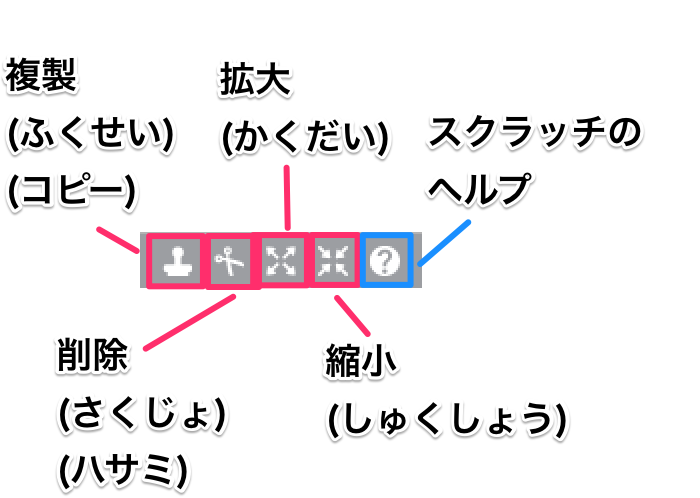

# Scratchの基本

## メイン画面について

①ステージ・・・実際のゲーム画面になります。
②スプライト・・・キャラクターや障害物など、ゲームを構成するものです。
③スプライトリスト・・・「新しいスプライト」から使うものを選ぶと、ここに使うスプライトが表示されます。
④タブ・・・選んだスプライトの「スクリプト」「コスチューム」「音」の3つが編集できます。「背景」のときはコスチュームのところが「背景」になります。
⑤カテゴリー・・・「動き」「見た目」「音」「ペン」「データ」「イベント」「制御」「調べる」「演算」「その他」といったように、種類別にブロックを分けてあります。
⑥ブロック・・・プログラム(台本)をつくる言葉のもとになります。プログラミング言語。全部で150以上あり、これを組み合わせてプログラミングをしていきます。
⑦ブロックパレット・・・言葉のもとであるブロックの種類をリスト化したものです。
⑧スクリプトエリア・・・ブロックを組み合わせ、プログラムを作る場所です。選んだスプライトに対するプログラミングができます。ブロックのかたまり(台本)は、どこに置いてもOKです。スクリプトとは、コンピュータを動かすプログラム(台本)のことです。
⑨バックパック・・・何個ものスプライトに同じ命令をするとき、ここにつくった「台本」を入れておくと、コピーして使うことができます。プログラムの保管場所です。

 

## アイコンについて

 

## プログラムでネコを動かしてみよう

- ネコを10歩動かす
- 端に着いたら、跳ね返す
- 回転させる
- コスチュームをかえる
- 背景をかえる
- 角度を102度にかえる
- マウスで触ったら「ニャー」と鳴く

### 問題1

- マウスで触ったら「大きさを300%」にする
- マウスで触ったら「つかまったと2秒言う」にする
- マウスで触っていない時は「大きさを50%」にする

### 音楽を流そう

- jungleを流す
